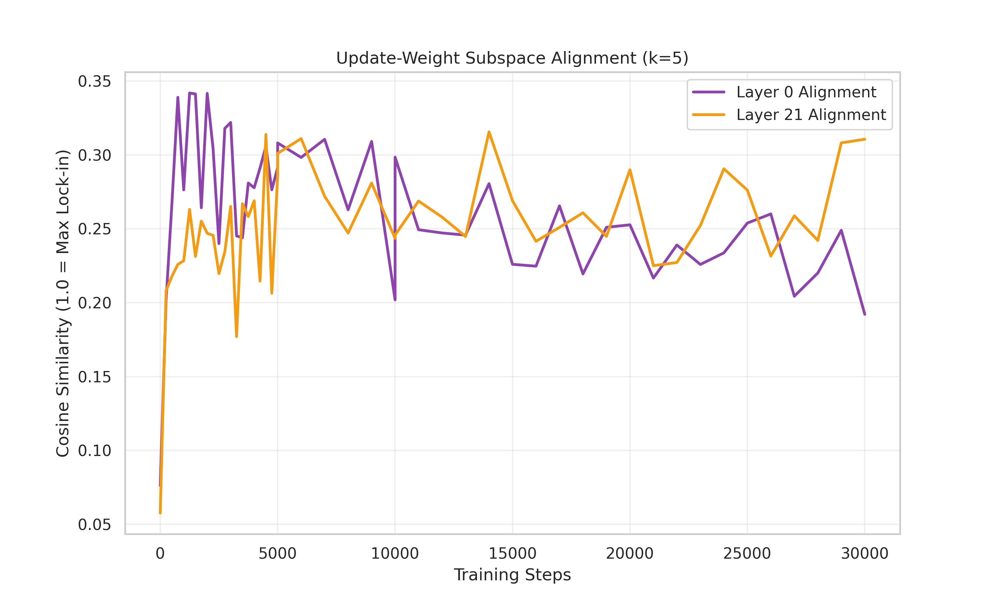

# 📐 Subspace Persistence: The Geometric Engine of Muon Training [trash title]

When training with the **Muon optimizer**, we observe a persistent and divergent growth in the spectral norms of deep layers—a phenomenon we've dubbed **Hierarchical Stretching**.

This raises a fundamental question about the geometric efficiency of the training trajectory: **Does this norm growth represent a directed accumulation of signal within a stable singular subspace, or is it a symptom of gradient 'drift' where updates are simply piling up without refining a specific representation?**

---

## 🔍 The Research Question

> **"How does the directional alignment between the Muon update $(\Delta W)$ and the weight matrix $(W)$ evolve across the network depth, and can we use the decay of 'Spectral Entropy' to characterize the informational bottlenecking of the Transformer?"**

While it is well-known that deep layers specialize, the **mechanics** of this specialization under orthogonal constraints are largely unexplored. We are measuring the **Subspace Persistence Rate**—the average cosine alignment between the top-$k$ singular vectors of the weight and its update—to determine if Muon enables a more stable and geometrically coherent path to feature convergence than standard Adam-based methods.

---

## 🛠️ The Concept: Subspace Refinement vs. Manifold Drift

Think of the weight matrix's evolution as a path along a high-dimensional manifold.

### 1. High-Entropy Exploration (The Basis)
In early layers, we expect the "Alignment Score" to stay low. This indicates that the update is constantly finding new directions to adjust, keeping the **Spectral Entropy** high. The layer remains a broad-spectrum feature extractor, maintaining its rank to capture diverse low-level patterns.

### 2. Subspace Lock-in (The Feature)
In deeper layers, we hypothesize a transition to a "Reinforcement Regime." Here, the update $\Delta W$ consistently aligns with the existing top singular vectors of $W$. This **Lock-in** reduces the effective dimensionality of the layer (dropping entropy) while increasing the signal gain (stretching the norm). This is the geometric signature of a layer "maturing" into a specialized semantic circuit.

---

## 📊 Measuring the Invisible (20M Token Update)

We've integrated two specialized metrics into our training pipeline to observe this in real-time:

### 1. Subspace Alignment Score ($\rho$)
The mean cosine of the **principal angles** between the top-5 singular subspaces of $W$ and $\Delta W$. 
- **$\rho \to 1.0$**: The optimizer is doubling down on existing features (Exploitation/Lock-in).
- **$\rho \to 0.0$**: The optimizer is pivoting into new directions (Exploration/Rotation).

### 2. Normalized Spectral Entropy ($H_{spec}$)
The Shannon entropy of the squared singular value distribution. 
- **$H \approx 1$**: Full-rank capacity utilization.
- **$H \ll 1$**: Representation collapse into a low-rank core.

---

## 📈 The Hypothesis of Representational Maturity

Our 20M token run is designed to test if there is a **critical threshold** of training where layers transition from Exploration to Lock-in. By correlating this transition with the loss curve, we aim to prove that Muon improves training by providing a more direct, geometrically regularized route to this "Representational Maturity."

---

*(Real-time plots from our 20M training run...)*

---
*Stay tuned as we track the manifold in real-time.*
