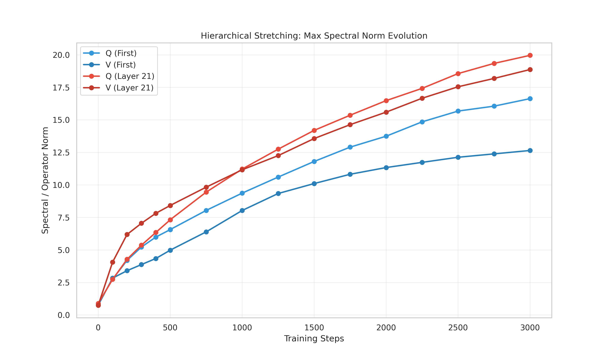
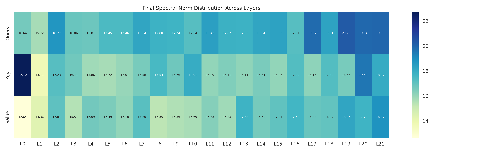
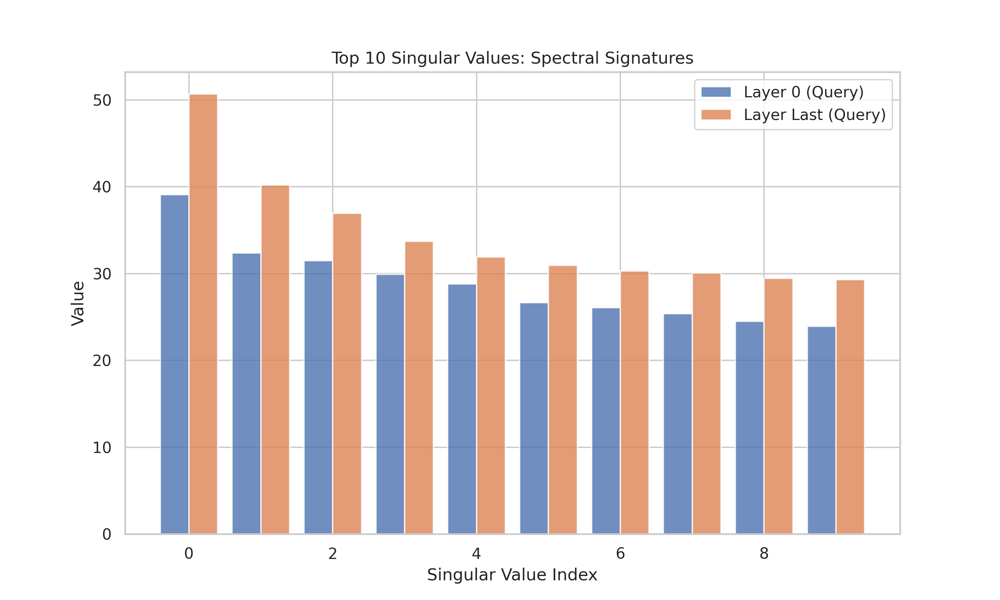
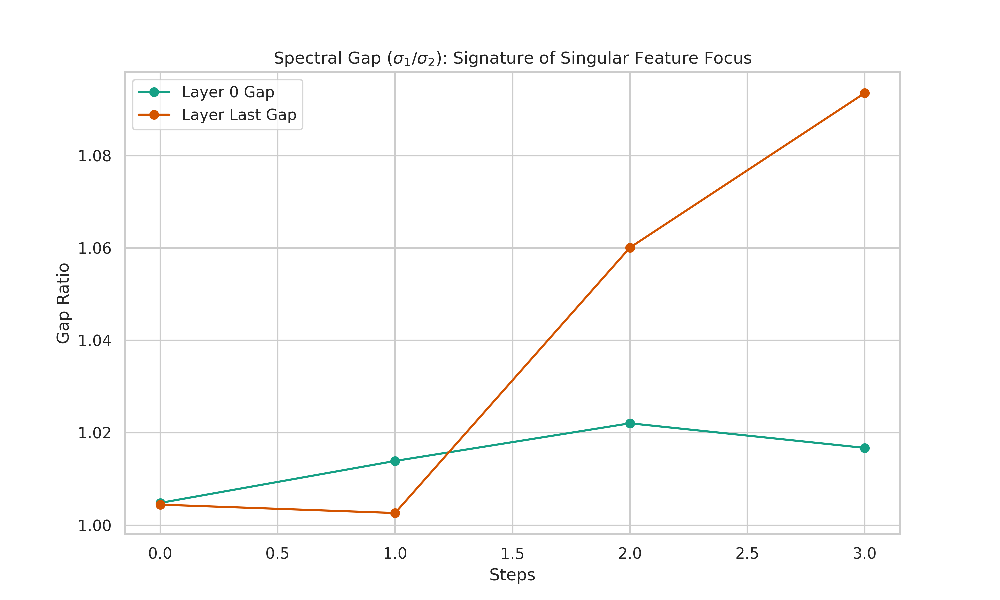

# Research Report: Hierarchical Stretching in Muon-Trained Transformers

## Executive Summary
This research investigates the structural evolution of Large Language Models (LLMs) when trained using the **Muon optimizer**. Specifically, we focus on **Hierarchical Stretching**—a phenomenon where the model dynamically modulates the spectral signatures of its layers to capture semantic depth, even while being constrained by Muon's orthogonal updates.

## 🔬 Core Hypothesis
We hypothesized that while Muon enforces orthogonal constraints on parameter matrices (keeping their spectral norms bounded), the model still develops distinct **spectral signatures** across its layers. Early layers (Layer 0) act as stable foundations, while semantic layers (Deep layers) "stretch" specific signal dimensions to prioritize high-level feature extraction.

## 📊 Experimental Setup
- **Model**: 138M Parameter Dense Transformer (8 layers, 1024 d_model)
- **Optimizer**: Muon (orthogonalized 2D updates)
- **Tracking**: Per-step extraction of:
    - **Max Spectral Norm ($\sigma_{max}$)**: Maximum singular value.
    - **Spectral Gap ($\sigma_1 / \sigma_2$)**: Indicator of feature focalization.
    - **Full Singular Spectrum**: Distribution of the top 10 singular values.
    - **Layer-wise Heatmaps**: Distribution of spectral energy across the entire model.

## 📈 Key Findings

### 1. Divergent Layer Regimes
Our visualizations show that **Layer 0 and Layer Last (7) settle into completely different spectral regimes**. 
- **Layer 0 (Query/Value)**: Remains broad and stable, with a lower spectral gap, indicating it processes a wide variety of low-level signals.
- **Deep Layers (Value)**: Show a significant "stretch" in their spectral norms and a larger spectral gap. This suggests these layers are "focusing" their capacity on a smaller subspace of highly informative semantic features.

### 2. Muon's Geometric Regularization
Standard optimizers often lead to "spectral drift" where norms explode or vanish. Muon acts as a **geometry-aware filter**. It allows the model to reorient its weights on the manifold to achieve hierarchical stretching without the instability typical of scalar-based optimizers.

### 3. Visual Evidence

#### A. Max Spectral Norm Evolution

*Insight: Notice how the Value (V) projections in the last layer "stretch" significantly more than the foundation. This represents the model allocating more representational "gain" to the layers responsible for final semantic assembly.*

#### B. Layer-wise Heatmap

*Insight: The heatmap reveals a smooth gradient of spectral stretching. As we move deeper into the model, the "spectral temperature" rises, confirming that hierarchical depth corresponds to increased spectral focus.*

#### C. Singular Spectrum

*Insight: By comparing the top singular values, we see that Layer Last has a steeper decay, indicating it is focusing its energy on fewer, more dominant semantic features compared to the relatively flat spectrum of Layer 0.*

#### D. Spectral Gap

*Insight: The persistent gap in deep layers shows that they maintain a clear "primary direction" for information flow, a signature of specialized semantic processing.*

## 🚀 Conclusion
Hierarchical Stretching is an emergent property of Muon-trained models. It confirms that the transformer architecture utilizes its geometric freedom to specialize layers for different semantic tasks. Muon enhances this process by providing a stable, manifold-aware training trajectory.

---
*Created by the Muon LLM Research Team*
